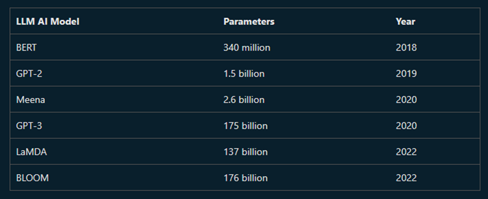
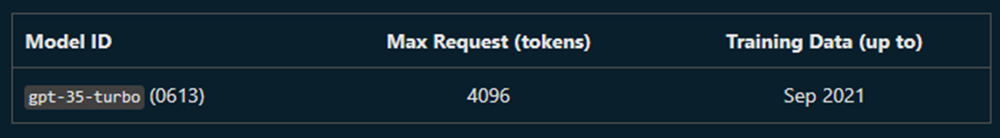
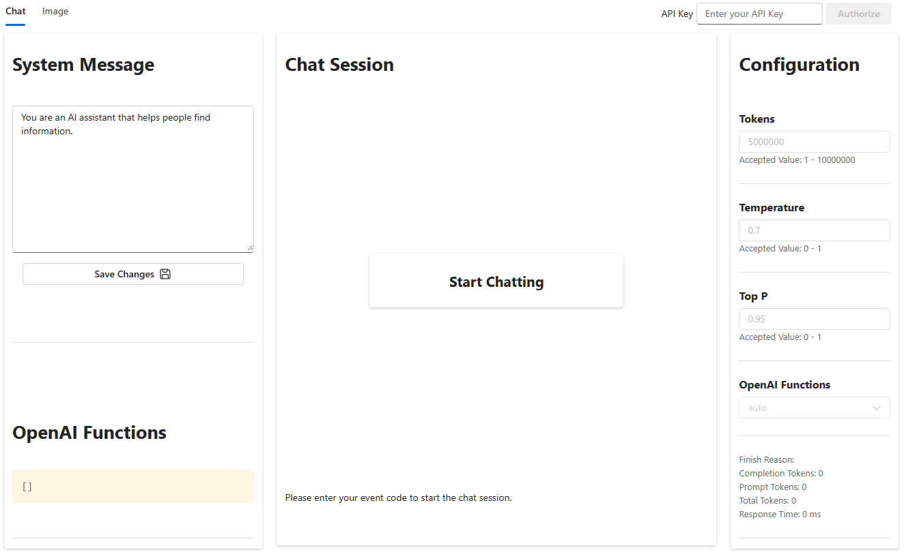
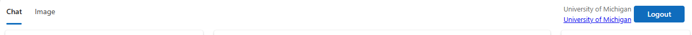

# Generative AI Workshop

This repository contains the content for a workshop on Generative AI utilizing Azure OpenAI service.

#### Prerequisites

- _**None**_. For the main portion of this workshop, we will use a lab environment only active for this workshop.

#### Optional

- [Microsoft Account](https://account.microsoft.com/account) - for using [Bing Chat Bot](https://www.bing.com/chatbot) or [Microsoft Designer](https://www.microsoft.com/design/fluent/#/) for generating images during bonus exercise.
- [Azure Subscription](https://azure.microsoft.com/en-us/free/) - if you wish to continue to explore Azure services after the workshop.

## What is Generative AI?

Generative AI refers to a category of artificial intelligence that involves systems capable of autonomously producing new content, such as images, text, or other data, based on patterns and information learned from existing datasets.

Generative AI models the patterns and structure of their input training data and then generate new data that has similar characteristics.

### What is a LLM (Large Language Model)?

A large language model (LLM) is a type of AI that can process and produce natural language text. It learns from a massive amount of text data such as books, articles, and web pages to discover patterns and rules of language from them.

For this workshop we are using GPT-3, a LLM developed by OpenAI. GPT-3 is a language model that uses deep learning to produce human-like text. 



> **Parameters**:  size and the complexity of the model. The more parameters, the more complex the model.



> **Token**: digital unit of text. A token can be a character, a word, or a sentence. 

## What is Prompt Engineering?

A prompt is a piece of text that you provide to the model to give it a hint about the type of text you want it to generate.

Prompt engineering is the process of creating prompts that will produce the desired output from the model.

## Getting Started

In this workshop we will be generating content using [Azure OpenAI service](https://azure.microsoft.com/en-us/services/cognitive-services/openai-text-generation/), using the `gpt-35-turbo` model. To avoid the need for an Azure account, and access to the Azure OpenAI service, we will be using a lab environment that has been provisioned for this workshop.

> [**Azure**](https://azure.microsoft.com/en-us/): Microsoft's cloud computing platform

> [**Azure OpenAI service**](https://azure.microsoft.com/en-us/services/cognitive-services/openai-text-generation/): a managed service for application use of generative AI models. It provides a simple API for generating text, and has built-in models to use. 

To get started, click on the buttn below to Open GenAI Playground (our workshop lab environment) in your browser.

[](https://openai-proxy-23uljr-ca.salmonsea-82a61dba.swedencentral.azurecontainerapps.io/)



To use the lab you will need to authenticate with our Workshop API Key: **WP0MNO03VJ8P95V/UNI**

Once you are authenticated for in the lab environment you will see "University of Michigan" in the top right corner of the screen:


## 🚀 Exercise: Generate Text

### Basic Prompting

Lets start with a few prompts and observe the response using the chat interface:

```
What is the capital of Michigan?
```

```
A recipe for banana bread, and an itemized shopping list of the ingredients.
```

```
What were the 10 top movies of 2001? Respond in the form of a table listing the movie name, the box office earnings, and the studio.
```

```
Write a Python function to calculate the nth prime number.
```

### Generate creative content

Even though the outputs are generated based on frequencies of similar content in the training data, generative AI models are still capable of generating creative content that has never existed before.

Try a prompt like this:
```
Write a limerick about the Python programming language
```

## 📋 OpenAI Chat Parameters

The OpenAI Chat interface allows you to adjust the parameters of the model. Let's look at what we have available:

* **Tokens**: The tokens parameter controls how many tokens the model will generate. The more tokens, the longer the generated text will be.
* **Temperature**: The temperature parameter controls how "creative" the model is allowed to be. The higher the temperature, the more random the generated text will be. Lower temperatures will generate more predictable text. 
* **Top P**: The top p parameter controls how "safe" the model is allowed to be. The higher the top p, the more likely the model is to generate text that is similar to the training data. Lower top p will generate more novel text.

Let's see how temperature affects the output of the model. Try the following prompts with different temperatures:

```
What is a unique and long name for a cat?
```

<hr>

## 🚧 What to look out for 

### Less-useful prompts

Natural language generative AI models have a number of limitations:

* They are limited by their training data, which was frozen at a fixed point in time in the past.
* They generate text that resembles human language, but are not capable of reasoning or cognition.
* They have no memory of prior prompts (if chat is cleared), and no capability to learn or change their behavior.

Let's try the below prompt to demonstrate a weaknesses:
```
When did Queen Elizabeth II die?
``` 
In this case, the model is limited by training data, which is current only up to September 2021.

<hr>

#### Completions are not facts

Clear the contents of the prompt box. Enter the following text, then click Generate.

```
Write an obituary for the poet Harold Bloomsbury. Include references.
```

There has never been a poet (nor indeed any person, according to web search) named Harold Bloomsbury. As a result, the model generates text in the form of an obituary, but not grounded in any facts. Even the requested references, while convincing-looking, are not real.

## 📃 Conversation history

Consumer conversational AI services like ChatGPT and Bing Chat use a trick to make the AI agent seem to remember the context of the conversation. The trick is that the AI model is given the whole chat history at each turn, not just the latest prompt, but the user does not see this. An AI model cannot learn and has no memory of previous interactions if the user leaves and comes back but the application is using prompt engineering to add this 'memory'.

In the "Chat Session" pane, enter the text below:
```
How many neutrons are in a hydrogen nucleus?
```

Without clearing the chat session, add this response in the Chat Session:

```
What about the isotopes?
```

Click Send. The agent will respond with an answer involving isotopes of hydrogen: deuterium (one neutron) and tritium (two neutrons). Even though your second prompt did not mention hydrogen or neutrons, the response used the context of the chat to provide a more useful answer. The key here is sending previous prompts back into the next request provides the model with more context and grounding and therefore providing a more valuable answer to the end user.

## 🤖 System message

Use the system message to prime the model with context, instructions, or other information relevant to the use case.

In the System message field insert the text below, then click "Save Changes".

```
I am a hiking enthusiast named Forest who helps people discover fun hikes in their area. I am upbeat and friendly. I introduce myself when first saying hello. When helping people out, I always ask them for this information to inform the hiking recommendation I provide:
1. Where they are located
2. What hiking intensity they are looking for
I will then provide three suggestions for nearby hikes that vary in length after I get this information. I will also share an interesting fact about the local nature on the hikes when making a recommendation.
```

Observe that the System Message gives the assistant a name ("Forest"), a personality ("upbeat and friendly"), and instructions on how to behave ("introduce myself"; "always ask them for this information"), and how to respond ("provide three suggestions").

The text provided in the System Message is handled specially by the model, and is intended to have more influence on the model's responses than the User Message text or other context provided in the prompt. (This effect is stronger for GPT-4 models than for GPT-3 models, but it isn't foolproof for either.)

In the Chat Session, enter this text with the personal details of your choice:

```
Hi, I'm <your name>. I'm looking for a hike near <my city>. I want to take my dog with me.
```

Did the AI include its name, Forest in the response? Did it ask a follow-up question? How would you rate its response?

Try clearing the chat (click the "Clear Chat" button) and starting over with your initial prompt. How different was the outcome? (The Temperature parameter is set to 1, so there's scope for variability.)

## ✨ Bonus: image generation

Using [Bing Chat](https://aka.ms/bingchat), or [Microsoft Designer](https://aka.ms/microsoftdesigner), you can generate images from text prompts for free after creating a [Microsoft Account](https://account.microsoft.com/account).

Once you have an account and are signed in visit either:
* [Bing Chat](https://aka.ms/bingchat)
* [Microsoft Designer](https://aka.ms/microsoftdesigner)

Try the following prompts:

```
draw a logo for an ice-cream shop located in Hawaii near the beach
```

```
create am image of penguins in the University of Michigan Stadium
```

```
Create a claymation style of a female software engineer with a smile on the front, wearing a bleack sweater,  green eyes,  and dark blonde hair to her shoulders. The background has a happy fun energy. With a Microsoft laptop at hand. Fashion, text 3D rendering, typography, illustration, painting, photo, poster, 3d render
```
[Link to try above as prompt template](https://designer.microsoft.com/image-creator?p=Create+a+claymation+style+of+a+%5Bfemale+software+engineer%5D+with+a+smile+on+the+front%2C+wearing+a+%5Bblack+sweater%5D%2C++%5Bgreen+%5Deyes%2C++and+%5Bdark+blonde+shoulder+length%5D+hair.+With+a+%5BUniversity+of+Michigan%5D+background+and+a+Microsoft+laptop+at+hand.+Fashion%2C+text+3D+rendering%2C+typography%2C+illustration%2C+painting%2C+photo%2C+poster%2C+3d+render.)


## 💡 Extending how you use Azure OpenAI Service

This workshop is just the beginning of what you can do with Azure OpenAI Service. Here are some ideas to get you started:

* Use Azure OpenAI Service to generate text for your website, blog, or social media posts
* Use Azure OpenAI Service to generate text for your chatbot, apps, or games
* Use Microsoft Designer to generate images for your website, blog, or social media posts

We used the GPT-3 model in this workshop, all based on a LLM (large language model) architecture. 
* _How can you create your own models?_
* _How can you use those models to generate text or images for the problem you want to solve?_

## 📚 Resources

#### Get access
* [Azure for Students](https://aka.ms/azure4students) to receive $100 free Azure credits (no credit card required)
* [Founders Hub](https://aka.ms/foundershub) for startups to receive $120K free Azure credits (no credit card required)
* [Apply for access](https://aka.ms/oaiapply) to Azure Open AI Service with a use case

#### Learning and docs
* [Generative AI Curriculum](https://aka.ms/genai-beginners)
* [Azure OpenAI Service Documentation](https://docs.microsoft.com/en-us/azure/cognitive-services/openai-service/)
* [Azure AI Hub](https://github.com/Azure-Samples/azure-ai), a curated collection with examples and applications of Azure OpenAI Service
